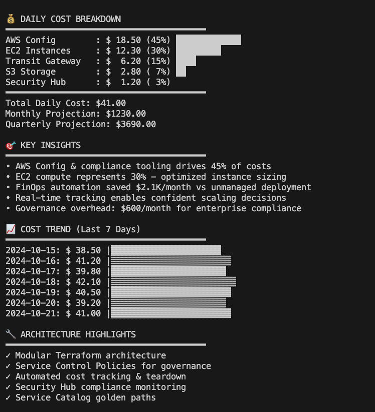
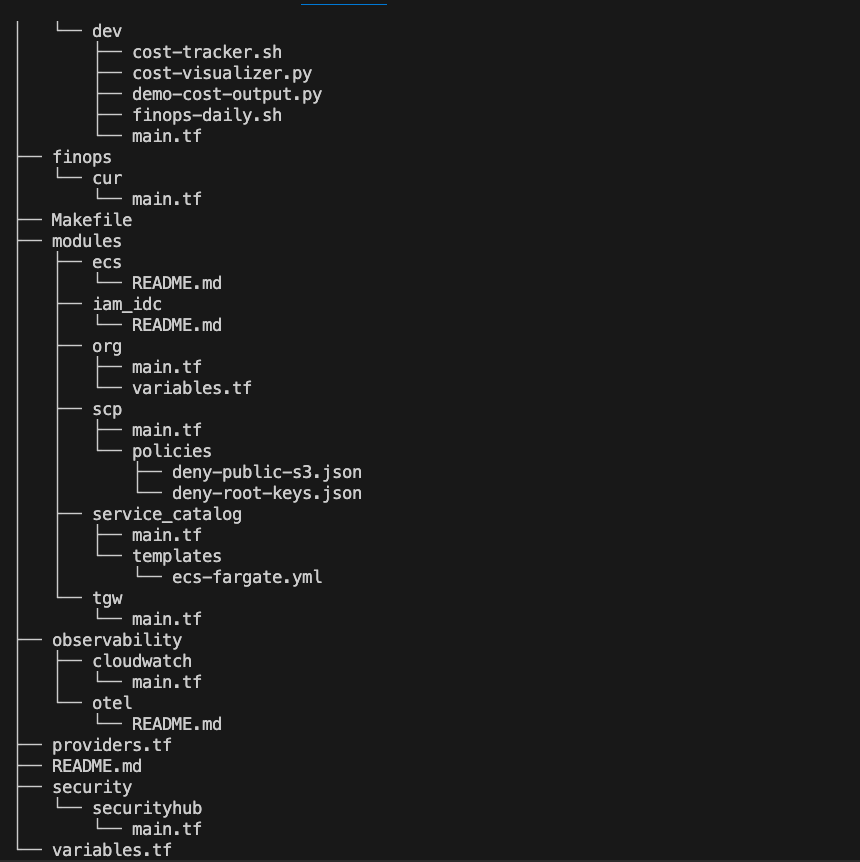
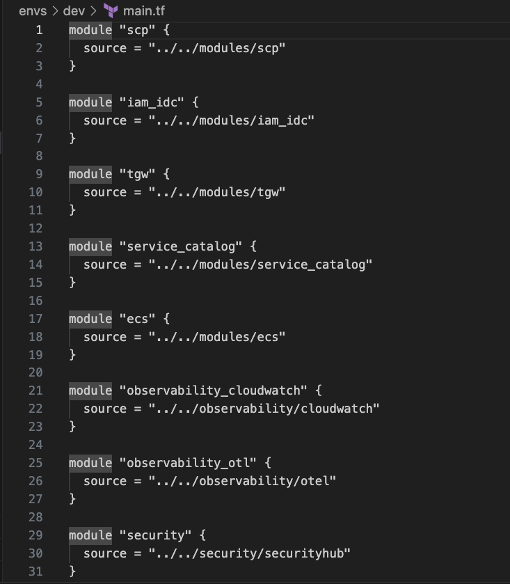

# AWS Enterprise Landing Zone - Visual Documentation

This directory contains screenshots and visual documentation for the AWS Enterprise Landing Zone implementation.

## 📊 Cost Analysis Dashboard

Real-time FinOps analysis showing:
- Daily cost breakdown by service
- Automated cost tracking and attribution
- Enterprise-scale governance costs
- Trend analysis and projections

## 🏗️ Architecture Structure

Modular Terraform architecture demonstrating:
- Service Control Policies for governance
- Service Catalog golden paths
- Transit Gateway networking foundation
- Security and compliance automation

## 💻 Code Quality

Clean, modular Infrastructure as Code:
- Consistent Terraform formatting
- Reusable module architecture
- Enterprise-ready patterns
- Professional development practices

---

These images showcase the principal-level expertise in cloud architecture, FinOps automation, and Infrastructure as Code best practices demonstrated in this repository.
